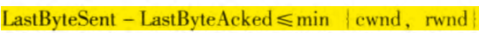
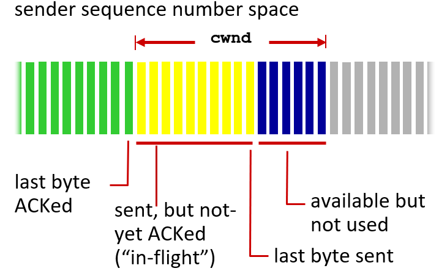
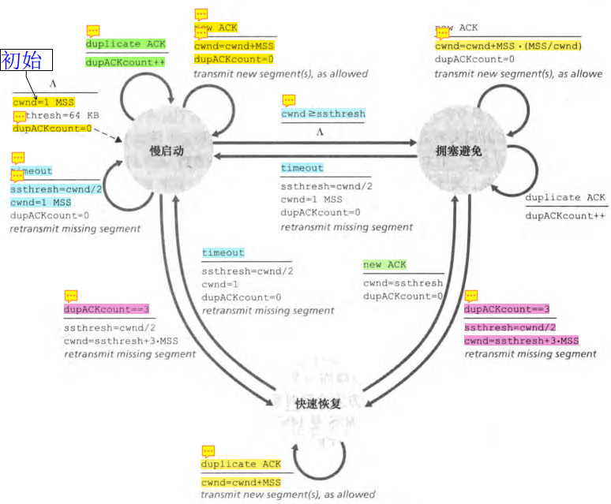
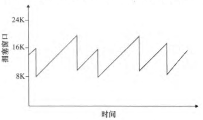
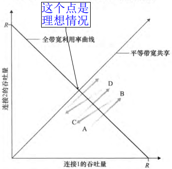
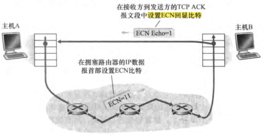

发送方根据**所感知到的网络拥塞程度**，**限制**其能向连接**发送流量的速率**

---

*如何限制发送速率？*

**拥塞窗口（cwnd）**

__发送速率≈cwnd/RTT 字节/s__

*如何感知拥塞？*

丢包事件：超时 / 收到3个冗余ACK —— 拥塞的指示

**自计时** TCP使用确认来触发增大拥塞窗口长度

---

*如何确认应当发送的速率？*

#### TCP拥塞控制算法

- 慢启动
  - 从1开始，指数级增长（翻番）
  - 超时丢包
    - 将**慢启动阈值（ssthresh）**设为**cwnd/2**
    - **cwnd设为1**，重新开始慢启动
  - 当cwnd达到ssthresh时
    - 结束慢启动，转移到**拥塞避免模式**（谨慎地线性增长，而不再指数级增长）
  - 检测到3个冗余ACK
    - **快速重传**，进入**快速恢复状态**

- 拥塞避免
  - 每个RTT只将cwnd的值增加一个MSS
  - 超时丢包 —— 同慢启动
  - 检测到3个冗余ACK
    - **cwnd减半**（考虑到有3个冗余ACK，所以加上3个MSS）
    - 进入**快速恢复**

- 快速恢复
  - 收到一个冗余ACK
    - **cwnd+MSS**
  - 收到新的ACK
    - **降低cwnd**，进入拥塞避免状态
  - 超时丢包 —— 同慢启动

---

#### AIMD拥塞控制

上述拥塞控制中，假设收到3个冗余ACK：

每个RTT内cwnd线性增加1MSS（**加性增**，Additive-Increase）；出现3个冗余ACK时cwnd减半（**乘性减**，Multiplicative-Decrease）

---

#### 公平性

K条TCP连接，都经过一段传输速率为R bps的**瓶颈链路**

---

#### 网络辅助拥塞控制（Explicit Congestion Notification, ECN）

**ECN比特** IP数据报首部有2个比特，指示该路由器正在经历拥塞

