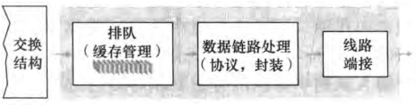

---

#### 输入端口

- 32-bit IP地址，**最长前缀匹配规则**，查表确定输出端口
- 进入交换结构（可能要排队）

---

#### 交换

- 经内存交换
  - CPU（路由选择处理器）直接控制；像I/O设备一样，**中断**
  - 

- 经总线交换
  - 不需要路由选择处理器干预
  - 输入端口为分组预先计划一个**交换机内部标签**，指示本地输出端口
  - 分组在总线上传送，传输到输出端口
  - 分组能被所有输出端口收到，但只有与标签匹配的端口才能保存该分组
  - 

- 经互联网络交换
  - **纵横式交换机**，开启/闭合交叉点
  - 能够**并行转发多个分组**
  - 

---

#### 输出端口

---

#### 何处出现排队

假定输入线路速度与输出线路速度均为$R_{line}$，有N个输入端口和N个输出端口；交换结构的传送速率为$R_{switch}$

理想情况：​$R_{switch}$​比​$R_{line}$​快N倍，则最坏情况下所有N条输入线路都在接收分组，并且所有分组都被转发到相同的输出端口

##### 输入排队

- **线路前部（HOL）阻塞**
  - 某分组被位于线路前部的另一个分组阻塞
  - 

输出排队

没有足够内存来缓存一个入分组时

- **弃尾（drop-tail）**（丢弃到达的分组），或删除已排队的分组
- **主动队列管理（Active Queue Management, AQM）算法** 缓存填满之前便丢弃分组
  - **随机早期检测（Random Early Detection, RED）算法**

---

需要多少缓存？

$B(缓存量) = RTT(平均往返时延) * C(链路的容量)$

---

#### 分组调度

- **先进先出（FIFO）**
- **优先权排队（priority queuing）**
  - 
  - 非抢占式优先权排队：一旦分组开始传输，就不能打断（即使有更高优先权的分组到达）

- **循环和加权公平排队**
  - 分组同上一样被分类，但类之间不存在优先权；**轮流**提供服务
  - 加权：每个类被分配一个权
  - 

