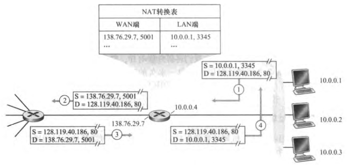

#### IPv4数据报格式

版本：IPv4 / IPv6

- 版本（4-bit）：IPv4 / IPv6
- 首部长度（4-bit）：数据报可包含一些可变数量的选项；一般的IP数据报具有20字节的首部
- 服务类型（8-bit）：低时延/高吞吐量/可靠性
- 数据报长度（16-bit）：理论最大长度为2^16=65535字节（实际很少超过1500字节）
- 标识、标志、片偏移：IP分片
- 寿命（Time-To-Live, **TTL**）：确保数据报不会永远在网络中循环（每经过一台路由器-1）
- 上层协议：用于数据报到达目的地时，指明数据部分应交给哪个运输层协议（值为6表明交给TCP，值为17为UDP）；__将网络层与运输层绑定到一起__
- 首部检验和：将首部中每2个字节当作一个数，反码求和
- 源IP地址 & 目的IP地址
- 选项
- 数据（有效载荷，**payload**）

---

#### IPv4数据报分片

**最大传送单元（MTU）** 一个链路层帧能承载的最大数据量

*链路的MTU比IP数据报长度小怎么办？*

**分片** 将IP数据报中的数据分成多个较小的IP数据报（**片**），用单独的链路层帧封装

*原则：网络内核保持简单；因此数据报的重新组装工作由端系统完成*

- 标识号：生成一个数据报时，发送主机为数据报贴上标识号；目的主机通过检查**相同的标识号**确认分片
- 标志比特：最后一个片置为0，其他置为1（为了让目的主机相信它已收到最后一个片）
- 偏移字段：指定该片在初始IP数据报的位置

---

#### IPv4编址

一个IP地址与一个**接口**（主机/路由器与一条链路的边界）相关联

**点分十进制记法** 每个字节（8-bit）用它的十进制书写，各字节间以句点隔开

##### 子网

##### 无类别域间路由选择（CIDR）

- 子网寻址
  - 32-bit的IP地址被划分为两部分，具有形式a.b.c.d/x（x指示第一部分的比特数）
  - x最高比特构成IP地址的**网络部分**（**前缀**）；一个组织通常被分配一块连续的地址，即具有相同前缀
  - **最长前缀匹配**（最具体的地址前缀）

广播地址：255.255.255.255

获取一块地址

- 获取一块地址
  - 从ISP获得地址
  - 因特网名字和编号分配机构（ICANN）管理ISP地址

- **动态主机配置协议（DHCP）**
  - **DHCP发现报文**
    - 使用广播目的地址255.255.255.255 & 源地址0.0.0.0
    - 链路层将该帧广播到该子网连接的所有节点
  - **DHCP提供报文**
    - 包含：收到的发现报文的事务ID，向客户推荐的IP地址，网络掩码及IP地址租用期
    - 向子网的所有节点广播
  - **DHCP请求报文**
    - 新客户从一个或多个服务器中选择一个
  - **DHCP ACK**
    - 服务器响应，交互完成

---

#### 网络地址转换（NAT）

右侧的10.0.0.1， 10.0.0.2， 10.0.0.3是家庭网络中的编址，这些接口具有相同的网络地址10.0.0.0/24（用于家庭网络等专用网络）；在一个给定的家庭网络中可以用10.0.0.0/24编址彼此发送分组，但转发到家庭网络之外的分组显然不能，因为有数十万的网络在用这块地址

##### NAT使能路由器

- 对外界隐藏了家庭网络的细节
  - 所有离开家庭路由器 / 进入家庭的报文都拥有同一个源 / 目的IP地址

- **NAT转换表**
  - 源IP地址转换为WAN一侧接口的IP地址，并更换端口号（反之同理）
  - 

