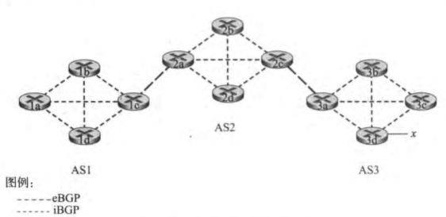

#### AS间路由选择协议 —— 边界网关协议（BGP）

分组被路由到**CIDR化的前缀**

**网关路由器（gateway router）** 位于AS边缘，直接连接其他AS中的一台或多台路由器

**内部路由器**

**外部BGP连接（eBGP）** & **内部BGP连接（iBGP）**

通告前缀中包含了**BGP属性**

- **AS-PATH** 通告已经通过的AS列表
- **NEXT-HOP** AS-PATH起始路由器接口的IP地址

##### hot potato routing

自私算法，尽可能快地将分组送出本AS

