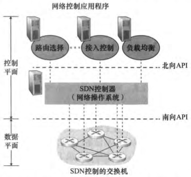
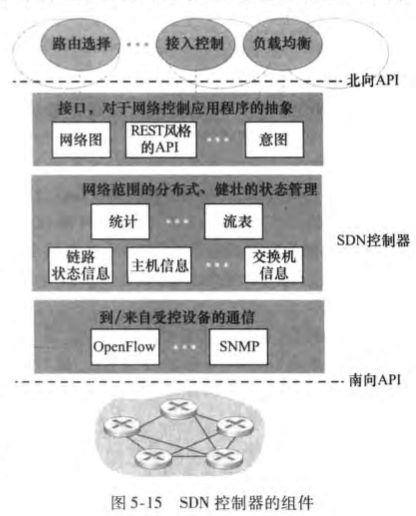
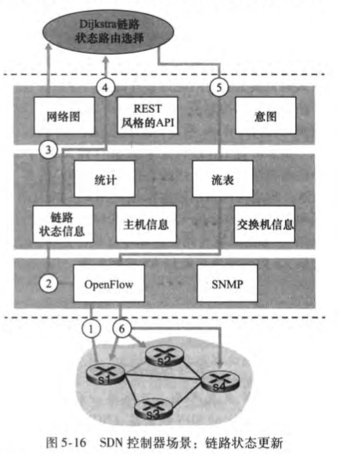

特征：基于流的转发；数据平面与控制平面分离；网络控制功能；可编程的网络

---

- 通信层：SDN控制器 -- 受控网络设备之间的通信（南向API）
- 网络范围状态管理层
- 对于网络控制应用程序层的接口（北向API）

---

#### OpenFlow协议

运行在SDN控制器和受控交换机之间，默认端口号6653

控制器→受控交换机：配置；修改状态；读状态；发送分组

受控交换机→控制器：流删除；端口状态；分组入

---

#### 数据平面与控制平面交互

