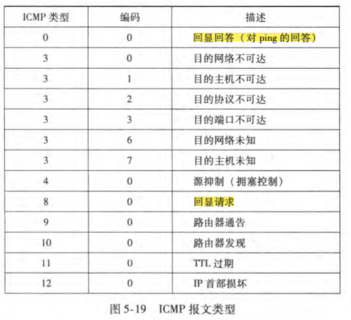

典型用途：差错报告

ICMP报文承载在IP分组中，<a href="onenote:4%20网络层%20数据平面.one#4-3%20网际协议&section-id={D3D2C492-76C2-4E06-9AFE-9907B6CDFFED}&page-id={D910D5CB-4E6F-4E5A-9B25-516EBC488B44}&object-id={E6EF12C9-2A14-0E3A-3C21-179E64446A80}&F8&base-path=https://d.docs.live.net/1f65032c09a11ca3/Documents/yuebaitu%20的笔记本/4各学科/3CS/玥自学/计算机网络">上层协议编码</a>为1

报文含有：一个类型字段、一个编码字段、引起该ICMP报文首次生成的IP数据报的首部 & 前8个字节

应用：Ping程序（回显请求，回显回答）、Traceroute程序（第n个数据报的TTL为n，到达第n个路由器被丢弃，并返回一个ICMP类型为11的警报文）

