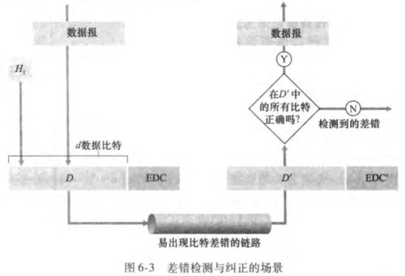
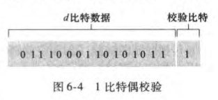
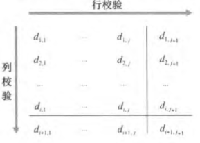
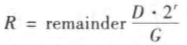
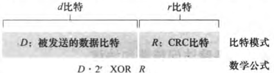

**差错检测和纠正比特（Error Detection and Correction, EDC）**

---

#### 奇偶校验

**奇偶校验位（parity bit）**

单比特偶校验

- 发送信息D有d比特，发送方**附加一个比特**，使得这d+1比特中**1的总数是偶数**（奇校验类似）
- 接收方发现有奇数个1——**奇数个比特差错**
- 但无法检测**偶数个比特差错**（未检出的差错）

二维奇偶校验

- d个比特被划分为i行j列，对每行每列计算奇偶值，产生**i+j+1个差错检测比特**
- 假如这d个比特出现了单比特错误，包含此比特值的列和行的校验值都将出错！于是可以**定位**差错并纠正

**前向纠错（FEC）** 接收方检测和纠错的能力

---

#### 检验和

将d比特作为一个k比特整数（因特网检验和中是16比特）的序列处理

---

#### 循环冗余检测（CRC）

**CRC编码（多项式编码）** 将发送的比特串看作__系数为0和1的多项式__

- **生成多项式** 发送方与接收方协商的r+1比特模式（要求MSB为1）
- 对于数据段D，发送方选择**r个附加比特**，使得得到的d+r比特模式**用模2算术恰好能被G整除**
  - **模2算术** 不考虑进位和借位，因此加减法相当于XOR，乘除法都是左右移位
  - ​R满足：​$D∗2^r XOR R=nG$​​ → ​$D∗2^r=nG XOR R$​ → ​$D∗2^r=nG+R$​
    

    

    

可以检测少于r+1比特的突发差错

