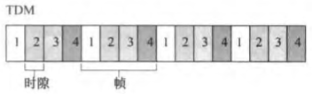
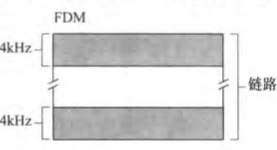
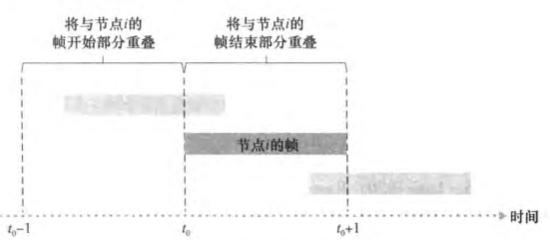

**点对点链路**

**广播链路** —— 碰撞

三种多路协议：信道划分协议，随机接入协议，轮流协议

理想情况下，对于速率为R bps的广播信道

- 仅有一个节点发送数据时，该节点具有R bps的吞吐量
- 有M个节点发送数据时，每个节点吞吐量为R/M bps
- 协议是分散的：不会因某主节点故障而使整个系统崩溃
- 协议是简单的

---

#### 信道划分协议

**时分多路复用（TDM）**

- 在时间上共享广播信道：**时间帧** —— **时隙（slot）**
- 每个时隙分配给一个节点
- 优点：消除碰撞；公平
- 缺陷：节点被限制于R/N bps的平均速率（即使是唯一一个要发送分组的节点）；节点必须总是等待轮次

##### 频分多路复用（FDM）

- 将信道划分为不同**频段**（每个具有R/N带宽）
- 每个频率分配给一个节点
- 优点和缺陷同TDM

##### 码分多址（CDMA）

- 对每个节点分配一个**编码**
- 不同节点能够**同时**传输

---

#### 随机接入协议

允许碰撞，并迅速恢复

##### 时隙ALOHA

假设：分组由L比特组成；时隙为L/R秒（等于传输一个分组的时间）；只在时隙起点开始传输

如果有碰撞，该节点在时隙结束之前检测到，以**概率p**在后续的每个时隙中重传分组，直到成功

- 优点：允许唯一活跃的节点以全速R连续传输；高度分散；简单
- 缺陷：（有多个活跃节点时）
  - **成功时隙** 刚好有一个节点传输的时隙
  - **效率** 长期运行中成功时隙的份额
    - 效率即只有一个节点传输的概率：**​**<!--[if mathML]><mml:math xmlns:mml="http://www.w3.org/1998/Math/MathML"><mml:mi>&#119925;</mml:mi><mml:mi>&#119953;</mml:mi><mml:mo fence="false">(</mml:mo><mml:mn>&#120783;</mml:mn><mml:mo>−</mml:mo><mml:mi>&#119953;</mml:mi><mml:msup><mml:mo fence="false">)</mml:mo><mml:mrow><mml:mi>&#119925;</mml:mi><mml:mo>−</mml:mo><mml:mn>&#120783;</mml:mn></mml:mrow></mml:msup></mml:math><![endif]-->**​​**（共N个节点，节点对新分组和重传分组都以概率p传输）
    - N趋于无穷时，最大效率仅为0.37

##### ALOHA

非时隙，完全分散

效率：**​**$p(1-p)^{2(N-1)}$**​**（在\[t0-1, t0\]和\[t0, t0+1\]两个时隙中都不能有其他节点传输）

  最大效率仅为1/(2e)（时隙ALOHA的一半）

##### 载波侦听多路访问（CSMA）

侦听——当空闲时传输

- **载波侦听** 节点传输前先听信道，等待没有传输的时间
- **碰撞检测** 节点在传输中一直侦听信道，检测到另一个节点在传输则立即停止传输
  - 产生碰撞的原因：**端到端信道传播时延**，某节点可能不能立即侦听到另一个节点的传输
  - **二进制后退算法**
    - 经历一连串的n次碰撞后，节点随机__从{0，1，2，…，2^n-1}中选择一个K值__
    - 等待K \* 512比特时间（即发送512比特进入以太网所需时间量的K倍）后，开始“侦听——当空闲时传输”
    - 经历的碰撞越多，时间间隔越长（呈指数增长）

- **效率** 长期运行中无碰撞传输的时间份额
  - ​$d_{prop}$​为信号能力在任意两个适配器之间传播用时；​$d_{trans}$​为传输一个最大长度的分组用时
  - ​$效率=1/（1+5d_{prop}/d_{trans})$**​**
  - <!--[if mathML]><mml:math xmlns:mml="http://www.w3.org/1998/Math/MathML" display="block"mathcolor="automatic" mathbackground="none"><mml:mphantom><mml:mpadded height="0" width="0"><mml:mrow><mml:mtext>d</mml:mtext><mml:mtext>_</mml:mtext><mml:mtext>{prop}</mml:mtext></mml:mrow></mml:mpadded></mml:mphantom><mml:msub><mml:mi>d</mml:mi><mml:mrow><mml:mi>p</mml:mi><mml:mi>r</mml:mi><mml:mi>o</mml:mi><mml:mi>p</mml:mi></mml:mrow></mml:msub><mml:mi>接</mml:mi><mml:mi>近</mml:mi><mml:mn>0</mml:mn><mml:mi>或</mml:mi><mml:mo>​</mml:mo><mml:mphantom><mml:mpadded height="0" width="0"><mml:mrow><mml:mtext>d</mml:mtext><mml:mtext>_</mml:mtext><mml:mtext>{trans}</mml:mtext></mml:mrow></mml:mpadded></mml:mphantom><mml:msub><mml:mi>d</mml:mi><mml:mrow><mml:mi>t</mml:mi><mml:mi>r</mml:mi><mml:mi>a</mml:mi><mml:mi>n</mml:mi><mml:mi>s</mml:mi></mml:mrow></mml:msub><mml:mi>接</mml:mi><mml:mi>近</mml:mi><mml:mn>1</mml:mn><mml:mi>时</mml:mi><mml:mprescripts/><mml:mo>，</mml:mo><mml:mi>效</mml:mi><mml:mi>率</mml:mi><mml:mi>接</mml:mi><mml:mi>近</mml:mi><mml:mn>1</mml:mn><mml:mprescripts/></mml:math><![endif]-->

---

#### 轮流协议

##### 轮询协议

- 节点之一被指定为**主节点**，它**轮询**每个节点（循环地发送报文，告知能够传输的分组的最多数量）
- 优点：消除了碰撞和空时隙
- 缺陷：轮询时延；不分散（主节点故障后，整个信道都不可操作）

##### 令牌传递协议

- **令牌（token）** 小的特殊链路层帧，在节点之间以固定次序交换
- 一个节点收到令牌，仅当需要发送帧时才持有，否则立刻传给下一个节点
- 优点：分散；效率高
- 缺陷：一个节点故障，可能使整个信道崩溃

-----

